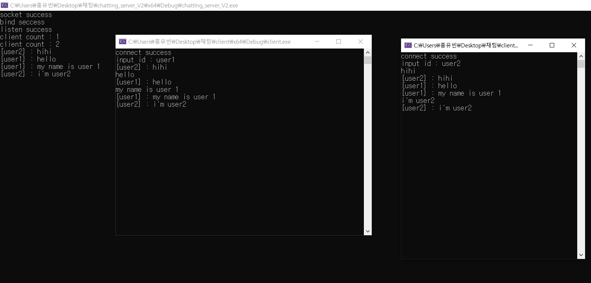

# 프로젝트 이름

   
  
   

목차

## 프로젝트 소개

소켓 프로그래밍 학습을 위해 채팅앱을 구현했습니다.

 

## 기술 스택

| C++ | 
| :--------: | 

 

## 구현 기능

### 기능 1
채팅 서버와 클라이언트 서버를 구현했습니다. 서로 통신해야 하기 때문에 TCP/IP 소켓 프로그래밍을 사용하였습니다.
### 기능 2
채팅 서버에서 클라이언트와 소켓 연결을 하는 기능과 클라이언트에게 메시지를 받고 다른 클라이언트에게 메시지를 전송하는 기능이 병렬적으로 처리돼야 합니다. 따라서 멀티 스레드로 이를 구현했습니다. 이때 전역변수인 globalClientSockets과 globalClientCount이 임계구역이 됩니다. 동시성 문제가 발생할 수 있기 때문에 mutex를 사용해서 동기화를 하여 해결했습니다.
### 기능 3
클라이언트에서 메시지를 받는 기능과 서버에 메시지를 보내는 기능이 병렬적으로 처리돼야 합니다. 마찬가지로 멀티 스래드로 구현했습니다.

 

## 배운 점 & 아쉬운 점
 단순한 기능이었음에도 운영체제와 네트워크의 핵심 개념을 활용하고 복습하게 되었습니다. 병렬 프로그래밍의 개념과 동작 방식을 이해하게 되었고 임계구역에서 문제가 발생하여 뮤텍스를 사용하면서 동기화 문제를 해결하였습니다. 또한 통신을 위한 소켓 프로그래밍을 하면서 클라이언트-서버 아키텍처를 이해하고 네트워크 통신에 대한 실전적인 경험을 쌓을 수 있었습니다.

 

## 라이센스

MIT &copy; [NoHack](mailto:lbjp114@gmail.com)

<!-- Stack Icon Refernces -->

[js]: /images/stack/javascript.svg
[ts]: /images/stack/typescript.svg
[react]: /images/stack/react.svg
[node]: /images/stack/node.svg
